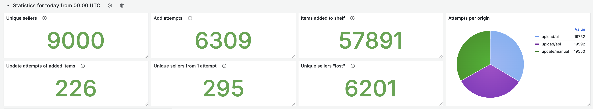
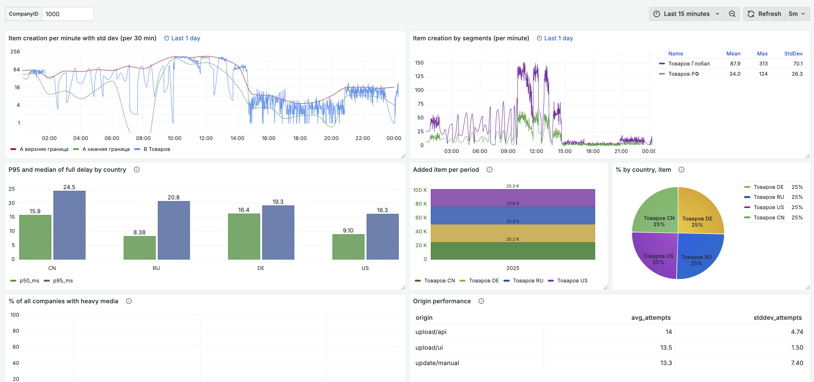
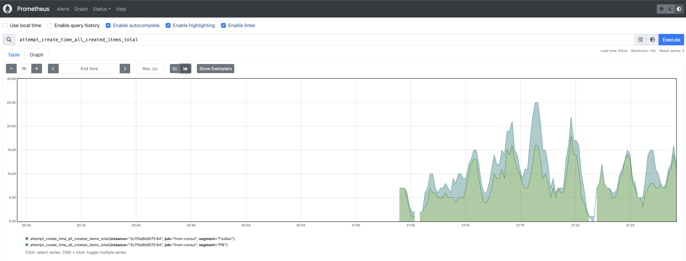
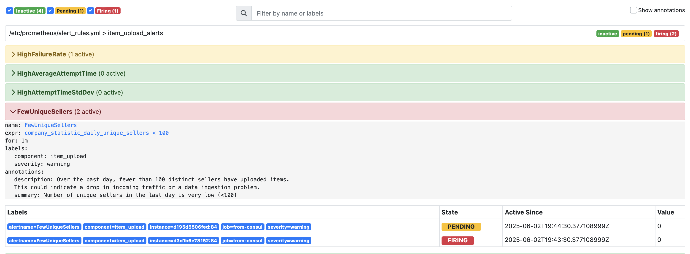
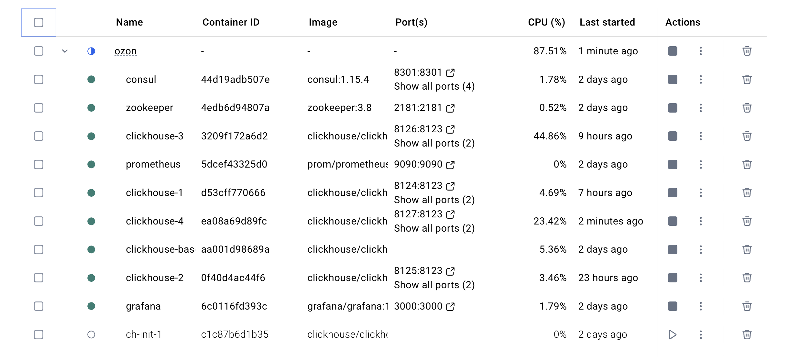
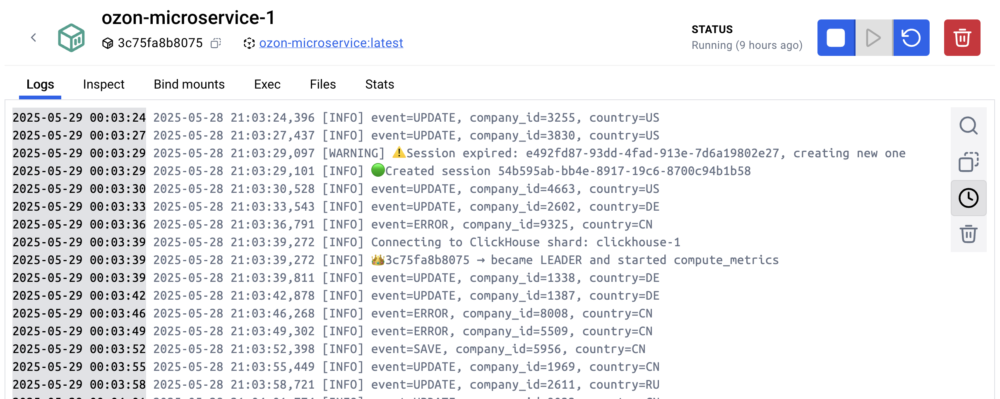

# Product Upload Dynamics Monitor (OZON)


> System for analysis and monitoring of upload dynamics on the on-line marketplace platfom OZON – built for **speed**, **scale** and a easy setup.
> 


<br>

## Key features

|   | Feature                                                                                                  |
| --- | -------------------------------------------------------------------------------------------------------- |
| 🔍  | **Live metrics** – latency, failure‑rate & throughput aggregated down to seconds                         |
| 🛠️ | **One‑file `docker‑compose.yml`** – deploy ClickHouse, Kafka, Grafana & Prometheus in 30 sec time |
| 📊  | **Beautiful dashboards** – pre‑provisioned Grafana boards (latency histograms, control charts)           |
| 📣  | **Smart alerts** – Prometheus rules ping you when error‑rate exceeds upper bound                 |


<br>

##   🖼️ Demo


<details open>
<summary style="font-size: 20px; font-weight: 600; text-decoration: underline"><strong>Statistics &amp; key metrics</strong></summary>

<br />

  




</details>


<details close>
<summary style="font-size: 20px; font-weight: 600; text-decoration: underline"><strong>Alert rules &amp; metrics in Prometheus</strong></summary>
</summary> <br />



</details>

<details close>
<summary style="font-size: 20px; font-weight: 600; text-decoration: underline"><strong>System runnung via Docker-compose</strong></summary>
<br />



</details>


<br>

## 🏗️ Tech Stack

| Layer             | Technology use                                                         |
| ----------------- | ------------------------------------------------------------------- |
| **Storage**     | [ClickHouse](https://clickhouse.com) – column‑store OLAP DB         |
| **Data stream**    | [Apache Kafka](https://kafka.apache.org) – durable event log        |
| **Dashboards**    | [Grafana](https://grafana.com) – live queries to db         |
| **Monitoring**    | [Prometheus](https://prometheus.io) – metrics + alert rules         |
| **Orchestration** | Docker-compose; Consul for leader election, Zookeper for sharding                      |
| **Language**      |  **Python 3.12** |


<br>

## ⚡ Quick start

```bash
# 1. clone & enter the repo
$ git clone https://github.com/<you>/upload‑monitor.git && cd upload‑monitor

# 2. deploy the project
$ docker compose up ‑‑build

# 3. explore
#   • Grafana → http://localhost:3000       (admin / admin123)
#   • Prometheus → http://localhost:9090    (no password)
#   • ClickHouse → localhost:9000           (default / default)
```

restart the whole system:
 ```bash 
docker compose down -v      
rm -rf ./clickhouse/data/clickhouse-*
rm -rf ./zookeeper/data
 ```

---

## 🛣️ Project Structure

```
.
├── README.md
│
📂 clickhouse/
│   ├── config/
│   │   ├── cluster.xml
│   │   ├── config.xml
│   │   ├── keeper.xml
│   │   └── users.xml
│   ├── node01/
│   │   └── macros.xml
│   ├── node02/
│   │   └── macros.xml
│   ├── node03/
│   │   └── macros.xml
│   └── node04/
│       └── macros.xml
├── docker-compose.yml              #   all services
│
📂 grafana/                         #   dashboards & datasource 
│   └── dashboards/
│      └── grafana_model_init.json
│
📂 microservice/
│   ├── Dockerfile
│   ├── compute_metrics.py
│   ├── config.py
│   ├── connect.py
│   ├── ddl.sql                     #   ClickHouse schema & views
│   ├── register_to_consul.py
│   ├── requirements.txt
│   └── simulate_data.py
│
📂 prometheus/                      #   alert rules
    ├── data
    └── etc
        ├── alert_rules.yml
        └── prometheus.yml


```


<br>


For checking tables in DBeaver that do not open initially:

 ```bash 
docker exec -it clickhouse-1 clickhouse-client --user default --password default --query "SELECT _shard_num, count() FROM item_upload.attempt_create_time_all GROUP BY _shard_num"\n
 ```

 ```bash 
docker exec -it clickhouse-4 clickhouse-client --user default --password default --query "SELECT * FROM item_upload.attempt_create_time_all LIMIT 10 FORMAT Vertical"
 ```
 ```bash  
 docker exec -it clickhouse-4 clickhouse-client --user default --password default --query "SELECT * FROM item_upload.attempt_create_time_all LIMIT 10"
 ```
 ```bash 
docker exec -it clickhouse-4 clickhouse-client --user default --password default --query "SELECT * FROM item_upload.company_statistic_all LIMIT 10"
 ```
 ```bash 
docker exec -it clickhouse-4 clickhouse-client --user default --password default --query "SELECT * FROM item_upload.company_statistic_daily_all LIMIT 10"
 ```